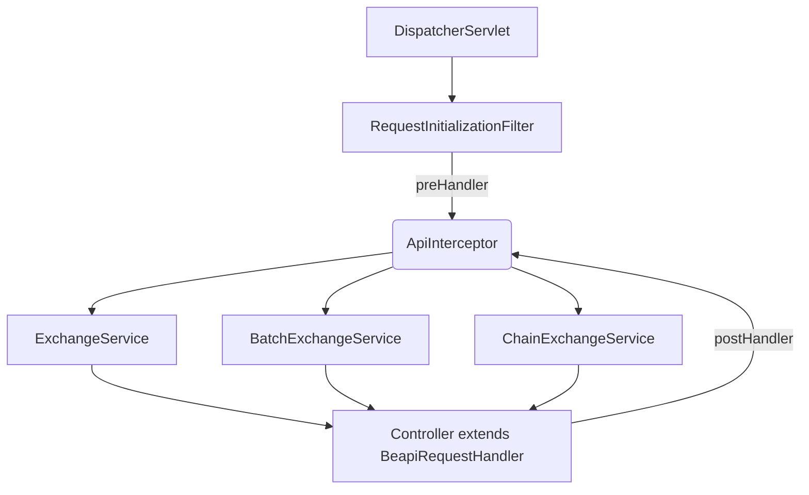

# BeAPI Spring Boot Starter

### Stable Version : 0.9.0-SNAPSHOT

### In-Development : 1.x

### Springboot Version : 2.6.2 (or greater)

### Java Version (for demo project) : 17

### Groovy Version (for spock test) : (v0.7.1) 2.5.4 / (v0.8.0+) 4.0.8

---

**License** - [Reciprocal Public License](https://en.wikipedia.org/wiki/Reciprocal_Public_License)

**Documentation** - [https://beapi-io.github.io/beapi-docs/](https://beapi-io.github.io/beapi-docs/)

**Demo Application** - [https://github.com/Beapi-io/beapi-java-demo](https://github.com/Beapi-io/beapi-java-demo)

**Configuration Files** - https://github.com/orubel/spring-boot-starter-beapi-config (Note : Move these into your 'iostateDir' location as found in your demo-application/src/main/resources/beapi_api.yaml file)

---
### BeAPI is an automated API backend.
It enables you to simply create the: 

- API schemas
- controllers
- domain models

  ... and everything else is automated for you! Security (JWT/CORS/RBAC/ABAC), Apidocs, Hateoas Link Relations, Tracing, Batching, Statistics, Governance, etc. It is a platform to simplify the weight of deploying an API backend so you can focus on other things.
  
---
## BeAPI stresses convention over config...
Most everything you need for API development should be provided & configured 'out of the box' **BUT** you have the ability to configure and override everything to your hearts content

## BeAPI automates API Governance...
Tradional API application's bind all rules/data to controllers (ie handlers) making them impossible to be shared amongst distributed services. Through the creation and support of standardized services in our configuration docs, Beapi automates all processes: security (RBAC/ABAC, CORS, JWT), caching, synchronization across all servers, etc.

## BeAPI simplifies configuration...
BeAPI abstracts these [RULES/data](https://gist.github.com/orubel/159e94db62023c78a07ebe6d86633763) as a 'config' file which is **loaded at runtime and can be reloaded and SYNCHRONIZED** with distributed services **without requiring a restart**.

## BeAPI automates common usage...
By abstracting the rules, this allows for easier automation and allows for:
- [automated batching](https://beapi-io.github.io/spring-boot-starter-beapi/advanced.html#section-1)
- [Api Chaining&reg;](https://beapi-io.github.io/spring-boot-starter-beapi/advanced.html#section-3)
- extremely simplified security setup
- automated api docs
- automated HATEOS link relations
- and more

---

## Functionality
- **Security**
  - [Zero Trust Security](https://www.ibm.com/topics/zero-trust) by default
  - Cors
  - Oauth2/JWT
  - Automated [Role Based Access Control (RBAC)](https://digitalguardian.com/blog/what-role-based-access-control-rbac-examples-benefits-and-more); 
  - Automated [Attribute Based Access Control (ABAC)](https://developer.okta.com/books/api-security/authz/attribute-based/)
  - Full OWASP API Security Compliance
  - Automated RBAC+OWASP checks on cache; this is something that [API Gateways do not do](https://medium.com/@apiexpert/why-api-gateways-are-dead-7c9e324ff70a) and we correct for.
  - Separate security/routing controls for public/private endpoints
- **Configuration Management**
  - Reloadable API RULES (ie connectors) WITHOUT server/application restart
  - Automated synchronization of API RULES w/ services via webhooks (will be adding to [beapi_java_demo](https://github.com/Beapi-io/beapi-java-demo))
- **Automation**
  - Automated Role-based Batching
  - API Chaining(R)
  - Autogenerated Role-based API Docs
  - Return type inference (Accept)
  - Automated LinkRelations ([SEE HATEOS](https://en.wikipedia.org/wiki/HATEOAS))
  - Connector Scaffolding (coming in 0.8.X)
  - Automated Role-based Webhooks (coming in 0.8.X)
- **Data**
  - CQRS for plugin data handling

---

**Gradle Implementation**
```
repositories {
	mavenLocal()
	mavenCentral()
	maven {
		url 'https://s01.oss.sonatype.org/content/repositories/releases'
	}
}

...

dependencies {
    ...
    implementation 'io.beapi:spring-boot-starter-beapi:0.9.0'
    ...
}
 ```

**Getting a Token and calling your api** - 

Using the [Java-demo implementation](https://github.com/Beapi-io/beapi-java-demo), this will get you your BEARER token to use in your calls/app:
```
curl -v -H "Content-Type: application/json" -X POST -d '{"username":"admin","password":"@6m!nP@s5"}' http://localhost:8080/authenticate
```

Then call your api normally:
```
curl -v -H "Content-Type: application/json" -H "Authorization: Bearer {your_token_here}" --request GET "http://localhost:8080/v{appVersion}/user/show/5"
```
---

# Q&A
- **Why develop in Groovy?**
    - Well as most people know, Apache Groovy is a JVM language that can be DYNAMICALLY/STATICALLY typed and is 100% compatible with Java. But what most people don't realize is that it is 3X faster than Kotlin (https://github.com/gradle/gradle/issues/15886). This makes it easier to develop in as well as being faster.
- **Why does the 0.6.0 version not build anymore?**
    - There was tracking code in the 0.6.0' version that was being used to track installs; This was mainly to see which corporations are violating the licensing. Now that we have that data, we no longer need the tracker installed. Unfortunately, this breaks the 0.6.0 build. Feel free to use the 0.7.0 build as it's more up to date :)
- **Why Not bind the endpoints to the 'MODEL'(ie GraphQL)?**
    - First 'resource' in API spec (per Roy Fielding) is used in the sense of 'Uniform Resource Indicator' (ie URI). This points to a service or business logic which then calls data which may be a mixture of two tables (ie JOIN), a file, a link to another api, etc. By binding to your model, you are asking it to become the 'business logic','communication logic' as well as 'data handling' and not only breaks the API spec/standard but limits what your API can return. This breaks rules of AOP, Separation of Control', OWASP API security and over complicates your build and testing. This also makes your entire environment slower and harder to scale. So yeah... bad idea in general.
- **Why require a cache?**
    - Caching is actually listed as part of the API requirements in Roy Fieldings dissertation; You cannot name an professional API implementation that does not use a cache. Unfortunately, many developers do not understand proper caching techniques (with API's). So we took that as an opportunity to handle that for you. You're welcome.
- **Doesn't changing your API Rules on the fly affect other existing requests?**
    - Why would it? You changed your api-version right? RIGHT???
- **Why not just use @RequestMapping, @GetMapping, etc?**
    - The RequestMapping annotations create HARD CODED 'rules' to functionality; you cannot update/synchronize these 'rules' across your shared servers. This breaks the rules for configuration management when applying rules for the shared state across your entire architecture and can create **[security issues in the api gateway](https://apiexpert.medium.com/why-api-gateways-are-dead-7c9e324ff70a)**. We abstract the rules away from the business logic so that they CAN be updated and shared with all running services WITHOUT requiring restarts. 
    - By abstracting this data from the functionality, we are better able to make LIVE CHANGES TO ENDPOINT RULES **when functionality hasn't changed**. So for example if we want to disable privileges or change how a certain ROLE accesses endpoints, we can do that on the fly without taking down servers.
- **Why can't 'API Chaining(R)' have more than ONE UNSAFE method in the chain?**
    - FIRST, You can only send ONE METHOD with a chain; you cannot send a PUT and POST method in the same call. But you can just default every other call to a SAFE call (ie GET) as long as client has AUTHORITY to the endpoint. SECOND, since it can only have one UNSAFE METHOD, you can only send ONE DATASET. We made it to be as simple as possible while encompassing the most commonly used calls thus simplifying the processing and the client call.
- **Isn't it BAD to send form data with a GET request? I thought you could only send URI encoded data??**
    - Per W3C guidelines : 'A client SHOULD NOT generate content in a GET request unless it is made directly to an origin server that has previously indicated, in or out of band, that such a request has a purpose and will be adequately supported'. API Chaining(tm) is that direct connection with purpose. It provides the necessary backend checks and limits what can be sent.

   
# Flowchart


